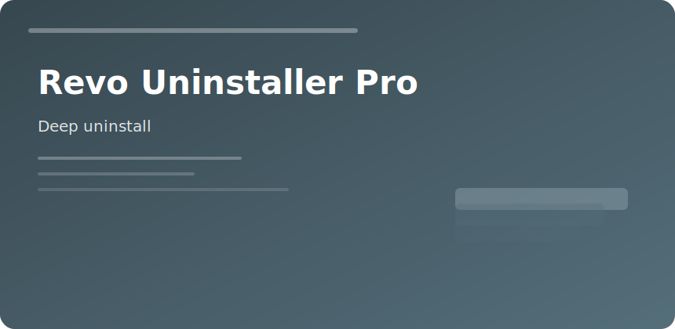

  

  

# Revo Uninstaller Pro

**Problem:** Add/Remove Programs leaves folders, services, and context menu junk.  
**Approach:** Uninstall → scan leftovers → delete with backup point.

### Modes

1. **Classic** — pick program, run vendor uninstaller, rescan
2. **Forced** — broken installs with missing uninstaller
3. **Monitor** — snapshot before/after new software trials

### Batch table

| Scenario | Setting |
|----------|---------|
| Trial cleanup | Monitor next 10 installs |
| Lab refresh | Export list, batch uninstall |
| Stubborn AV | Forced + safe mode |

Create restore point on production machines before aggressive registry cleanup.

revo uninstaller pro cleanup windows registry removal tool
